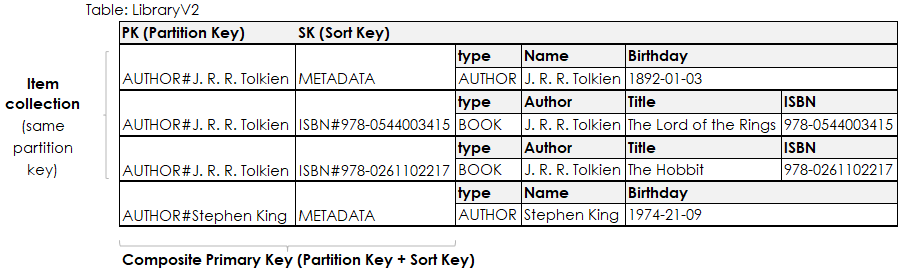

# DynamoDB


### DynamoDB Essentials

Amazon DynamoDB is a **fully managed**, **serverless**, **key-value NoSQL database** designed to run high-performance applications at any scale. DynamoDB offers built-in security, continuous backups, automated multi-Region replication, in-memory caching, and data import and export tools.

* Unlike hosted solutions such as Cassandra and Scylla, DDB is serverless, which means you have no infrastructure to manage on your own. 
* You have AWS’s API endpoint, which you call to create tables and indexes and perform CRUD (Create-Read-Update-Delete) operations. 
* You operate only the resources, which DDB provides: tables and indexes and DAX clusters


### Data structures
Data in DynamoDB is organized in tables, which sounds just like tables in relational databases, but they’re different. 
Tables contain items that may have completely different attributes from one another. 
There is an exception though and that relates to how data is accessed. 

**In DynamoDB you primarily access data on the basis of its primary key attributes and as a result of that, the attributes that make up the primary key are required for all items.**


The primary key is what **uniquely identifies an item in the table** and it’s either 
* a single attribute on an item (the partition key) or 
* a **composite primary key**, which means that there is a combination of two attributes (**partition key and sort key**) that identify an item uniquely. 

Let’s look at some examples.

This example shows a table that has only a partition key as its primary key. That means whenever we want to efficiently get an item from the table, we have to know its partition key. Here you can also see that a single table can contain items with different structures.


At this point I’d like to point out a few things about the table above. 
1. You can see that it uses generic names for the partition and sort key attribute (PK and SK) and this is done on purpose.   
When modelling data in DynamoDB we often try to put as many different entities into a single table as possible.   
Since these entities are identified by different underlying attributes, it’s less confusing to have generic attribute names. 
2. You can also see, that the values in the Key-Attributes are duplicated.  
The number behind the ISBN# sort key is also a separate attribute, same with the author’s name. This makes serialization and deserialization easier.

Putting all (or at least most) entities in a single table is the aptly named Single-Table-Design pattern.  
To enable working with such a table, each item has a type attribute that we can use to distinguish the different entities.  
This makes deserialization more convenient. 

Another effect of the single table design can be observed in the key attributes. 
The actual values like “J. R. R. Tolkien” or “Stephen King” have a prefix. 
This prefix acts as a namespace - it allows us to separate entities with the same key value but different type and helps to avoid key collisions inside of our table.


### Reading and Writing data
The options to write to DynamoDB are essentially limited to four API-calls:

**PutItem** - Create or replace an item in a table   
**BatchPutItem** - Same as PutItem but allows you to batch operations together to reduce the number of network requests only (**WCUs are the same as with PutItem**)  
**UpdateItem** - Create a new item or update attributes on an existing item   
**DeleteItem** - Delete a single item based on its primary key attributes   

For reading data we have a selection of another four API-Calls:

**GetItem** - retrieve a single item based on the values of its primary key attributes   
**BatchGetItem** - group multiple GetItem calls in a batch to reduce the amount of network requests   
**Query** - get an item collection (all items with the same partition key) or filter in an item collections based on the sort key   
**Scan** - the equivalent of a table scan: access every item in a table and filter based on arbitrary attributes   

**The Scan operation is by far the slowest and most expensive, since it scans the whole table, so we try to avoid it at all cost**. We want to rely only on GetItem (and potentially BatchGetItem) and Query to fetch our data, because they are very fast operations. Let’s visualize how these operations work.


### GET_author_by_name
```
response = table.get_item(
        Key={
            "PK": f"AUTHOR#{author_name}",
            "SK": "METADATA"
        }
    )
```

### GET_all_author_information
```text
 response = table.query(
        KeyConditionExpression=
            conditions.Key("PK").eq(f"AUTHOR#{author_name}")
    )
```

### GET_books_by_author
```text
 response = table.query(
        KeyConditionExpression=
            conditions.Key("PK").eq(f"AUTHOR#{author_name}") \
                & conditions.Key("SK").begins_with("ISBN")
    )
```


## Indexes
So far we have used different ways to fetch data from our table. All of these have been using attributes from the primary key.   
What if we want to select data based on an attribute that’s not part of the primary key?   
This is where things get interesting.   
In a traditional relational database you’d just add a different WHERE condition to your query in order to fetch the data.   

In DynamoDB there is the Scan operation you can use to select data based on arbitrary attributes, but it shares a similar problem as a where condition on unoptimized table in a relational database: it’s slow and expensive.

To make things faster in a relational database we add an index to a column and in DynamoDB we can do something similar. Indexes are very common in computer science. They’re secondary data structures that let you quickly locate data in a b-tree. We’ve already been using an index in the background - the primary index, which is made up of the primary key attributes. Fortunately that’s not the only index DynamoDB supports - we can add secondary indexes to our table which come in two varieties:

1. The **local secondary index (LSI)** allows us to specify a different sort key on a table. In this case the partition key stays identical, but the sort key can change. LSIs have to be specified when we create a table and share the underlying performance characteristics of the table. When we create a local secondary index we also limit the size of each individual item collection to 10GB.
2. The **global secondary index (GSI)** is more flexible, it allows us to create a different partition and sort key on a table whenever we want. **It doesn’t share the read/write throughput of the underlying table and doesn’t limit our collection size. This will create a copy of our table with the different key schema in the background and replicate changes in the primary table asynchronously to this one.**

**Secondary indexes in DynamoDB are read only and only allow for eventually consistent reads.**   
**The only API calls they support are Query and Scan - all others rely on the primary index**.  

In practice you’ll see a lot more GSIs than LSIs, because they’re more flexible.


### How can these help us?  
Suppose we want to be able to select a book by it’s ISBN. If we take a look at our table so far, we notice that the ISBN is listed as a key attribute, which seems good at first glance.  
Unfortunately it’s the sort key. This means in order to quickly retrieve a book, we’d need to know it’s author as well as the ISBN for it (Scan isn’t practical with larger tables).



The way our table is layed out at the moment doesn’t really work well for us, let’s add a secondary index to help us answer the query.   
The modified table is displayed below and has additional attributes that make up the global secondary index.  
I’ve added the attributes G**SI1PK as the partition key for the global secondary index and GSI1SK as the sort key**.  
The index itself is just named GSI1. The attribute names that make up the index are very generic again, this allows us to use the GSI for multiple query patterns.   
You can also see, that the GSI attributes are only filled for the book entities so far. Only items that have the relevant attributes set are projected into the index, that means I couldn’t use the index to query for the author entities at the moment. This is what’s called a sparse index. Sparse indexes have benefits from a financial perspective, because the costs associated with them are lower.


Back to our original question - how can we use this to fetch a book by its ISBN? That’s now very easy, we can just use the Query API to do that, as the next code sample shows. It’s very similar to a regular query, we just use different key attributes and specify the IndexName attribute to define which index to use (there can be multiple indexes on a table).

```
  response = table.query(
        KeyConditionExpression=conditions.Key("GSI1PK").eq(f"ISBN#{isbn}") \
            & conditions.Key("GSI1SK").eq("METADATA"),
        IndexName="GSI1"
    )


```


You might wonder why GSI1 has a sort key that seems to be set to the static value METADATA for all items. To implement this specific query pattern “Get a book by its ISBN”, a global secondary index with only a primary key would have been sufficient. I still went with a partition and sort key, because it’s common to overload a secondary index. This means you create a secondary index that not only fulfills one, but more than one query patterns. In these cases it’s very useful to have a partition and sort key available. By setting the sort key to a static value, we basically tell the system that there’s only going to be one of these items.

This has been an example on how you can use a global secondary index to enable different query patterns on our dataset. There are many more access patterns that can be modeled this way, but those will have to wait for future posts.

Let’s now talk about something different: performance and cost.

### Performance & Cost

DynamoDB has a few factors that influence performance and cost, which you can control:
* Data model
* Amount of data
* Read throughput
* Write throughput

The data model you implement has a major impact on performance. If you set it up in a way that it relies on scan operations, it won’t hurt you too much with tiny databases, but it will be terrible at scale. Aside from Scan all DynamoDB operations are designed to be quick at essentially any scale. That however requires you to design your data model in a way that let’s you take advantage of that.

The amount of data has a limited influence on performance, which may even be negligible if you design your data model well. In combination with read and write throughput it may have an influence under certain conditions, but that would be a symptom of a poorly designed data model. The amount of data is a cost component - data in DynamoDB is billed per GB per month (around $0.25 - $0.37 depending on your region). Keep in mind that **global secondary indexes are a separate table under the hood, that come with their own storage costs**. This should be a motivation to use sparse indexes.

Whenever your read from or write to your table you consume what’s called read and write capacity units (RCU/WCU). These RCUs or WCUs are how you configure the throughput your table is able to handle and there are two options you can do this with:
* **Provisioned Capacity**: You specify the amount of RCUs/WCUs for your table and that’s all there is. If you use more throughput than you have provisioned, you’ll get a ProvisionedThroughputExceeded exception. This can be integrated with AutoScaling to respond to changes in demand. This billing model is fairly well predictable.
* **On-Demand Capacity**: DynamoDB will automatically scale the RCUs and WCUs for you, but individual RCUs and WCUs are a little bit more expensive. You’re billed for the amount of RCUs/WCUs you use. This mode is really nice when you get started and don’t know your load patterns yet or you have very spiky access patterns.

A general recommendation is to start with on-demand capacity mode, observe the amount of consumed capacity and once the app is fairly stable switch to provisioned capacity with Auto Scaling. 

You should be aware that secondary indexes differ in the way they use the capacity.  
**Local secondary indexes share the capacity with the underlying base table whereas global secondary indexes have their own capacity settings.**

### Capacity Units

The benefits of managed, serverless AWS offerings are that we can measure the cost by a particular action and not only by a compute time. In regards to DynamoDB, we pay for the storage and the requests we perform against the table.

We treat these requests as **Capacity Units** — Dynamo’s load and request atomic items like IO operations. There are Write Capacity Units (WCU) and Read Capacity Units (RCU).

As you might guess, when you write to the table (PutItem, DeleteItem, UpdateItem) you consume WCUs, and one WCU is 1 (one) item of max 1 (one) Kb size. So if you write an item a size of 1.5Kb — 2 WCUs. Two items a size of 100 bytes — 2 WCUs.

1 (one) RCUs is 1 item maximum of max 4 (four) Kb size in a strong consistency or two items in an eventual consistency (covered later) of max 4 Kb s.

When using DynamoDB in on-demand mode (e.g. PAY_PER_REQUEST) we are billed for each R/WCU consumed. This brings us to the importance of using Query against Scan.

You see, no matter how you filter the results of the Scan call, you will pay for every single item obtained from the table (even if you don’t process it afterward). So if you have a table with a million items, each Scan will cost you 0.25 USD before Tax. That may not sound too expensive, but imagine if you perform tens of hundreds of such calls every minute (or even a second!), and all that to obtain a row or two.

Contrary to this, Query calls are billed for as many Items as they have accessed. Thus, if you have a million Items, and only ten of them match the request pattern, you will pay only 0.0000025 USD per call. Much cheaper, eh?

Another option to use DDB is provisioned capacity mode, e.g., you define how many R/WCUs you want to have straight and pay a fixed amount every month. The capacity units are provided per second, and if you send more requests in the second than you have provisioned, DynamoDB will throttle you (AWS SDKs usually have built-in retires and back-offs).

Usage of provisioned W/RCUs should be done only when the load is determined, you don’t expect any spikes, and your application tolerates throttling. It is possible to change the billing settings from on-demand to provisioned and backward but applies both to Read and Write CUs (e.g., you cannot have on-demand for writes and provisioned mode for reads).

Another thing to mention that LSIs consume table’s CUs, but GSIs have their own. While the table and GSI can have different R/WCU settings, both have to be either provisioned or paid per request.

### Reservation and Auto-Scaling
Consider having a stable workload seeing upfront towards a year, and you want to save some costs. In this case, you can purchase Reserved Capacity Units, which gives you some guaranteed lower annual price.

Another requirement is to have an auto-scaling on capacity units. While this doesn’t come out of the box purely for DynamoDB, we can leverage Application Auto-Scaling.

Application Auto-Scaling acts similarly to the EC2 Auto-Scaling. When a specific CloudWatch metric is reached, Application Auto-Scaling will send a UpdateTable call to DynamoDB. The setup process is trivial and is clearly explained in the AWS documentation.


### DynamoDB Consistency
If you are familiar with the terms ACID and CAP theorem — DynamoDB is A/P.

When you invoke PutItem and then immediately do GetItem for the same data, there is a chance that you will retrieve older data. There are several things we can do about that.

```
 characters.get_item(
     Key={
            'playerId': '7877e1b90fe2',
            'characterId': '74477fae0c9f'
     },
     ConsistentRead=True
)['Item']
```

Where’s the catch? Well, in the pricing. ;)

While **eventually consistent reads cost us 0.5 RCU (Read Capacity Unit), strongly consistent reads consume the whole RCU**.


### Additional features
DynamoDB offers many other useful features, like

* **DynamoDB Streams** allow you perform change-data-capture (CDC) on your DynamoDB table and respond to updates in your table using Lambda functions. You can also pipe these changes into a Kinesis data stream.
* **Transactions** allow you to do all-or-nothing operations across different items.
* **DynamoDB Global Tables** is a feature that allows you to create Multi-Region Multi-Master setups across the globe with minimal latency.
* **PartiQL** is a query language designed by AWS that’s similar to SQL and can be used across different NoSQL offerings.
* **DAX or the DynamoDB Accelerator** is an in-memory write-through cache in front of DynamoDB if you need microsecond response times.


### DynamoDB Streams

DynamoDB Streams is an implementation of CDC — Change Data Capture — a design pattern that allows for tracing changes happening here and there.

To enable Stream on a table, we need to update our table settings.

```
$ aws dynamodb update-table \
               --table-name characters \
               --stream-specification \
               StreamEnabled=True,StreamViewType=NEW_AND_OLD_IMAGES
{
# very long output...
"StreamSpecification": {
            "StreamEnabled": true,
            "StreamViewType": "NEW_AND_OLD_IMAGES"
        },
        "LatestStreamLabel": "2021-01-06T17:41:06.230",
        "LatestStreamArn": "arn:aws:dynamodb:REGION:ACCT_ID:table/characters/stream/2021-01-06T17:41:06.230"
    }
}
```
That was easy! Note the parameter StreamViewType — it indicates what exactly we put in the stream. At the moment of this writing, supported projections are:

* KEYS_ONLY — put the only primary key of the modified item
* NEW_IMAGE — only new changes
* OLD_IMAGE — only previous state
* NEW_AND_OLD_IMAGES — both new and previous state  

What you want to expose depends on your purchasing power's business needs, as **Streams are billed as Read Request Units**. So don’t forget to check the pricing section before enabling it!

#### Few more things we need to know before implementing Streams.

First, Streams integrate only with AWS Lambda. If you want to use different consumers, you want to integrate DynamoDB with Kinesis Streams. Second, the change lives 24 hours in the Stream. Speaking of TTL…

### DynamoDB Item TTL
DynamoDB is a great database to store and skim individual items of data. There might be cases when we don’t need the items to live forever. For this purpose, there is another feature called TTL (Time-To-Live).
The good thing about **TTL is that it happens in the background, and I am not being charged for the delete**. 
When TTL is enabled, the backend of DynamoDB will compare the TTL attribute with the current server time and delete the item from the table and every index if it is expired. If streams are enabled, it will also push an event into it to process that if needed.

If the item does not have a TTL attribute, it will not be deleted by a background worker, which allows us to combine disposable and persistent data in the same table.

TTLs are easy to implement and handy to use. Combined with Streams, we can even turn DynamoDB into a real-time streaming platform. And using Global Tables — into the planet-scale near-real-time streaming platform!

### DynamoDB Global Tables
Running a distributed system in a single data center is challenging yet doable. Running a distributed system in multiple data centers across continents is even harder and very expensive to achieve. 

Global Tables are multiple tables (also called replica) tables that share changes between each other. They can be created in different AWS regions in a single account.

Side note: when it comes to consistency and global distribution, one may start asking how the concurrency is managed. **For Global Tables, the last writer wins, and DynamoDB will do its best to determine who is that last writer**. At least that’s what AWS says.

DynamoDB Streams with NEW_AND_OLD_IMAGES are essential for the Global Tables to work.

### DAX
Database Systems developers are doing their best to build the world’s fastest databases. However, getting the data right from the computer's memory is always faster than reading it from persistent storage. The same applies to DynamoDB, so its development team introduced a proprietary caching system called DAX. Unlike ElastiCache for Redis, DAX acts as a proxy in front of the DynamoDB table, leveraging both caching strategies: lazy loading and write-through.

Creating a DAX cluster is slightly more complicated than creating a table as we need additional resources such as network subnets and IAM role with permissions to access a table. Below is the CloudFormation template to create the cluster.

Few more things before I let you go! 
1. DAX is an instance-based service, so you pay for the nodes, regular traffic costs, and the W/RCUs from DAX to DynamoDB. 
2. DAX also supports LSIs and GSIs, so you are never limited in features!


### DynamoDB Transactions


Amazon DynamoDB has added support for transactions to simplify the developer experience of managing complex business workflows that require adding, updating, or deleting multiple items as a single, all-or-nothing operation.

There is no additional cost to enable DynamoDB transactions, however, DynamoDB will perform two underlying reads or writes for each item in the transaction: one will be to prepare the transaction and the other one is to commit the transaction. You will have to keep this in mind if you want to use transactions.

With the transaction write API, you can group multiple Put, Update, Delete, and ConditionCheck operations. You can then group the actions into a single TransactWriteItems operation that either succeeds or fails as a unit.

The same is true for multiple Get operations, which you can group and submit as a single TransactGetItems operation.

### Idempotency
**DynamoDB also supports idempotency, and it allows you to pass a ClientRequestToken parameter, which will ensure you that the request is idempotent even if is submitted multiple times.**

Making your transactions idempotent helps prevent application errors if the same operation is submitted multiple times due to a connection time-out or other connectivity issue.


## DynamoDB Internals

https://www.amazon.science/blog/lessons-learned-from-10-years-of-dynamodb

